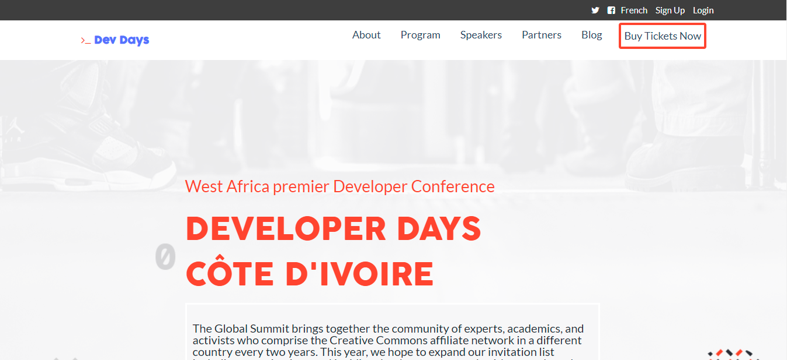
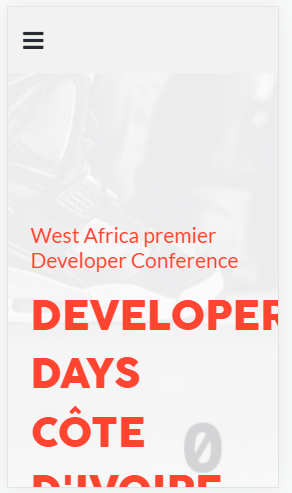

# Conference Website Capstone

This project contains the HTML, CSS and JavaScript Capstone Project. Capstone Projects are done at the end of a module at Microverse.

 

## Live Demo

[Live Demo Link](https://codecaiine.github.io/microverse-javascript)
 
## Built With

- HTML
- CSS
- Javascript
- Bootstrap 
- HTML&CSS Linter
- Git

## Get Started

Please get your browser update.
To get a local copy up and running follow these simple steps.

Run the command below from the Terminal:

      git clone <URL> in your terminal

	  cd microverse_portfolio

	  start index.html

## Authors

👤 **Yannick-Noel AKA**

- Location: Côte d'Ivoire
- GitHub: [@codecaiine](https://github.com/codecaiine)
- Twitter: [@yannicknaka](https://twitter.com/yannicknaka)
- LinkedIn: [LinkedIn](https://www.linkedin.com/in/yannick-no%C3%ABl-aka/)

## 🤝 Contributing

Contributions, issues, and feature requests are welcome!

Feel free to check the [issues page](https://github.com/codecaiine/microverse-javascript/issues).

## Show your support

Give a ⭐️ if you like this project!

## Acknowledgments

- Thanks to Microverse
- Paka OLIPLICHE
- Ellis Mwanawabangona

## 📝 License

This project is [MIT](./MIT.md) licensed.
